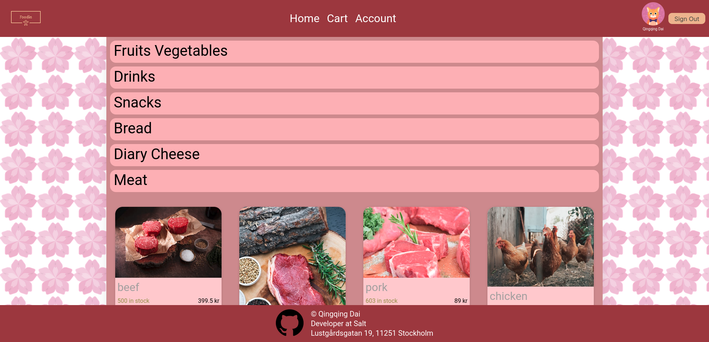

# Foodie - A food store website.  
This repo is the frontend part, built with React, TypeScript and Google Identity Services.  
Please run the [backend](https://github.com/qingqing0226/FoodStore-backend) first before running the frontend app.

### Note that Google account login needs approval
Currently authtication service is in testing mode and only my gmail account is in the allowed user list.
In order to login with your gmail account, please send me your email address, so I can add your email to the list.

## Functionalities & Structure
### Navbar
- supports login/logout via Google authentication
- has three options for switching pages
### Home page
- displays products in sections (Fruit & Vegetables, Snacks,Diary & Cheese, Drinks, Dry Food, Meat, Pet Products)
- each product card is clickable, which leads to a single detail page for the product (name, price, stock, image)
- the user can add product to the cart on the detail page
### Cart page
- displays items and total price
- requires the user to provide with their address and phone number
- the user can confirm their order
- A success page will be displayed after confirmation
### Account page
- displays account information and order history/status
- allows the user to update their information
### Footer
- contact info
- social media
- copyright

## Available Scripts

In the project directory, you can run:

### `npm i`

to install required packages, and 

### `npm start`

to run the app in the development mode.\
Open [http://localhost:3000](http://localhost:3000) to view it in the browser.

## Sample image of the website

For more images, please go to the folder `images`

